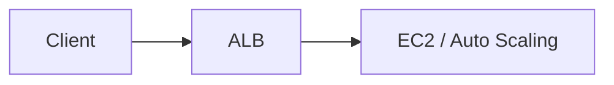
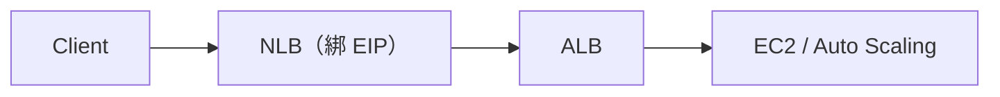
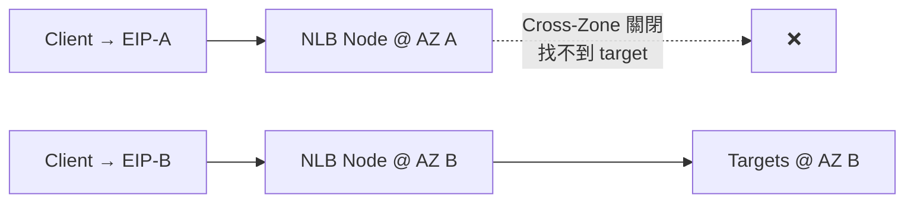

# AWS：從 ALB 改成 NLB + ALB 的踩坑紀錄

最近為了提供固定 IP 給合作方做白名單，把架構從單純的 ALB 改成 NLB + ALB。過程中遇到兩個不太直覺的問題：Laravel 拿不到真實 IP、某顆 NLB EIP 永遠 timeout。這篇記錄踩坑過程和解決方式。

---

## 為什麼需要 NLB + ALB？

原本架構：



ALB 的限制：

- 不能綁 EIP
- Public IP 會變動
- 無法提供固定 IP 給合作方做白名單

調整後架構：



- **NLB**：提供固定 IP（EIP），L4 轉發
- **ALB**：保留 L7 routing 能力（path、host 等）

---

## 問題一：Laravel 抓不到真實 Client IP

### 現象

改成 NLB + ALB 後，Laravel log 裡的 IP 變成：

```json
"ip": "172.31.38.xxx"  // VPC 內部 ALB node 的私有 IP
```

而不是使用者的真實 IP。

### 原因

**NLB 是 L4，不會處理 HTTP header，也不會加 `X-Forwarded-For`**

當請求流程變成：

```
Client → NLB → ALB → Laravel
```

如果 NLB 沒有保留 client IP，ALB 收到的連線來源就是 NLB 的內部 IP，寫入 XFF 的也會是錯的 IP。

### 解決方式

**1. NLB 端：啟用「保留用戶端 IP 位址」**

在 NLB 屬性中：

- Traffic configuration → **Preserve client IP addresses = On**

這樣 ALB 才能在 IP 層看到真正的來源 IP。

**2. ALB 端：調整 `X-Forwarded-For` 行為**

ALB 有三種模式：

- **Append（附加）**：在現有 XFF 後面追加（建議）
- Overwrite（覆寫）：覆蓋原本的 XFF
- Preserve（保留）：有就保留，沒有就不動

關鍵：如果設成 **Preserve**，而 NLB 又沒帶 XFF，ALB 就不會建立新的 XFF header，後端就拿不到真實 IP。

**建議設定：Append**

**3. Laravel 端：設定 Trust Proxies**

確保 Laravel 正確信任 proxy header 來解析真實 IP。

---

## 問題二：某顆 NLB EIP 永遠 curl 不到

### 現象

NLB 啟用兩個 AZ，各綁一個 EIP：

| AZ              | EIP            | 狀態    |
| --------------- | -------------- | ------- |
| ap-southeast-1a | 18.xxx (EIP-A) | timeout |
| ap-southeast-1b | 47.xxx (EIP-B) | 正常    |

打 EIP-B 正常，打 EIP-A 永遠 timeout（從外網或 VPC 內都一樣）。

### 原本對 Cross-Zone 的誤解

一開始的配置：

- **ALB**：啟用 A、B 區域，Cross-Zone 開啟
- **Auto Scaling EC2**：部署在 A、B、C 三個區域

當時以為：「ALB 有開 Cross-Zone，應該可以把流量轉到 C 區域的 EC2」

**實際狀況**：C 區域的 EC2 完全收不到流量

**原因**：ALB 必須「啟用某個 AZ」，才會在該 AZ 建立 node 作為入口。Cross-Zone 的作用是「在已啟用的 AZ 之間」分配流量，**不會自動把未啟用的 AZ 拉進來**。

### 加上 NLB 後的新問題

改成 NLB + ALB 架構後：

- **NLB**：啟用 A、B 區域，每個區域綁一個 EIP，Cross-Zone **關閉**
- **ALB**：啟用 A、B 區域
- **EC2**：實際只在 B、C 區域

流量路徑：

```
Client → NLB (A or B) → ALB (A or B) → EC2 (B or C)
```

問題出在：

1. **NLB A 區域**：有 node、有 EIP，但底下沒有任何 healthy target（ALB 在 A 區沒有 target，EC2 也不在 A 區）
2. **NLB Cross-Zone 關閉**：A 區的 node 無法把流量轉到 B 區
3. **結果**：EIP-A 永遠 timeout

而 EIP-B 正常是因為：

- NLB B 區 → ALB B 區 → EC2 在 B 或 C 區（ALB 的 Cross-Zone 可以處理）

### Cross-Zone Load Balancing 的作用

**前提**：只在「LB 已啟用的 AZ」之間生效

- **關閉**：每個 AZ 的 NLB node 只把流量丟給同 AZ 的 target
- **開啟**：每個 AZ 的 NLB node 可以把流量分配到所有已啟用 AZ 的 healthy target



**重點**：Cross-Zone 不會自動把「未啟用的 AZ」拉進來，只是讓已啟用的 AZ 之間可以互相支援。

### 解決過程

**嘗試 1：ALB 加上 C 區域**

- 讓 ALB 也啟用 C 區域，這樣 C 區的 EC2 就能收到流量
- EIP-A 的問題依然存在（因為 NLB A 區還是沒有 target）

**最終方案：統一 AZ 配置**

1. **開啟 NLB 的 Cross-Zone**（治標）
   - 讓 A 區的 NLB node 可以轉發到 B 區
2. **調整 Auto Scaling 到 A、B 區域**（治本）
   - 讓 EC2 只部署在 NLB/ALB 啟用的區域
   - 避免浪費 C 區域的資源和管理複雜度

---

## DNS 設定建議

雖然 NLB 有固定 EIP，但 DNS 建議這樣設計：

**對外文件**：列出 NLB 的 EIP 給合作方做白名單
**內部 DNS**：`api.xxx.com` → CNAME 指向 NLB 的 DNS 名稱（xxxx.elb.amazonaws.com）

原因：

- AWS 透過 ELB DNS 名稱處理底層節點更新
- 保留 DNS 層的彈性
- 符合 AWS 對 failover/routing 的預期行為

---

## 總結：NLB + ALB 的檢查清單

從單純 ALB 改成 NLB + ALB 時，這些設定要特別注意：

### Client IP / X-Forwarded-For

- ✅ NLB：`Preserve client IP addresses` = On
- ✅ ALB：`X-Forwarded-For header` = Append（不要用 Preserve）
- ✅ 後端：正確設定 trust proxy

### NLB + AZ + Cross-Zone

- ✅ 確認 NLB 啟用的 AZ 裡都有 healthy target
- ✅ 考慮開啟 Cross-Zone Load Balancing
- ✅ Auto Scaling 的 AZ 與 NLB/ALB 保持一致

### DNS

- ✅ 對外提供 EIP 清單（白名單用）
- ✅ 內部 CNAME 指向 NLB DNS 名稱

---

## 名詞補充

### ALB（Application Load Balancer）

- L7 負載均衡器，處理 HTTP/HTTPS
- 可依 Host/Path/Header 路由
- 自動處理 `X-Forwarded-For` 等 header

### NLB（Network Load Balancer）

- L4 負載均衡器，處理 TCP/UDP
- 可綁定 EIP 提供固定 IP
- 預設不啟用 Cross-Zone Load Balancing

### Target Group

- 定義流量要導向哪些資源
- 可以是 EC2、IP、Lambda、或另一個 ALB
- 負責健康檢查和 target 管理

### Cross-Zone Load Balancing

- 控制是否可跨 AZ 分配流量
- 前提：那些 AZ 必須在 LB 上被啟用
- 關閉時，各 AZ 的 node 只用同 AZ 的 target

### X-Forwarded-For（XFF）

- HTTP header，記錄經過多層 proxy 的原始 client IP
- 後端框架通常支援從 XFF 解析真實 IP

### EIP（Elastic IP）

- AWS 提供的固定 Public IP
- 可綁在 EC2、NAT Gateway、NLB 等
- 常用於 IP 白名單場景

---

## 參考資料

- [Elastic Load Balancing 的運作方式 - AWS 官方文件](https://docs.aws.amazon.com/zh_tw/elasticloadbalancing/latest/userguide/how-elastic-load-balancing-works.html?icmpid=docs_console_unmapped#availability-zones)
- [Understanding AWS Load Balancer and Target Group - RealNewbie](https://realnewbie.com/basic-concent/architecture/understanding-aws-load-balancer-and-target-group/)
