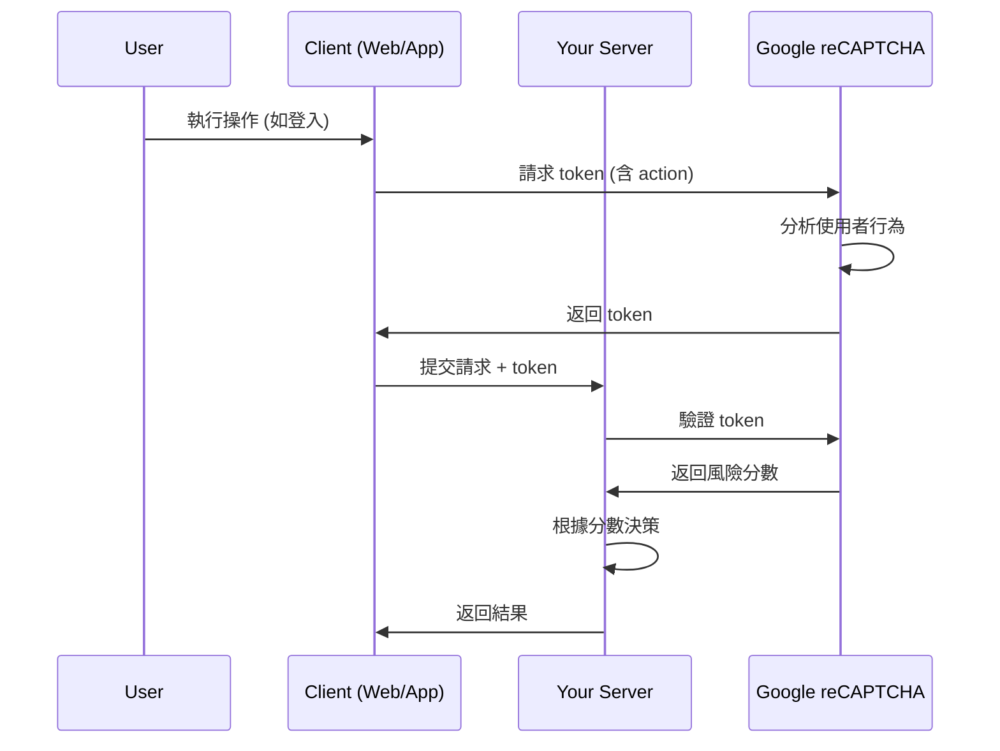

# 第 3 篇:Google reCAPTCHA Enterprise 深入解析

## 前言:通用人機識別的第一道防線

在上一篇文章中,我們了解了三大驗證機制的整體定位。現在讓我們深入探討第一層防護:**Google reCAPTCHA Enterprise**。作為跨平台通用的人機識別服務,它是所有應用的基礎防線。

## reCAPTCHA 的演進歷程

### 從 CAPTCHA 到無感知驗證

```
CAPTCHA 技術演進:
├── 第一代 CAPTCHA (2000年代初)
│   ├── 扭曲文字識別
│   ├── 使用者體驗差
│   └── 易被 OCR 破解
│
├── reCAPTCHA v1 (2007)
│   ├── 數位化書籍文字
│   ├── 雙重文字驗證
│   └── 仍需使用者輸入
│
├── reCAPTCHA v2 (2014)
│   ├── 「我不是機器人」勾選框
│   ├── 圖片識別挑戰
│   └── 內部使用風險分析（但不對外暴露分數）
│
├── reCAPTCHA v3 (2018)
│   ├── 完全無感知驗證
│   ├── 風險分數 (0.0-1.0)
│   └── 無需使用者互動
│
└── reCAPTCHA Enterprise (2020)
    ├── 整合 v2 和 v3 優點
    ├── 企業級功能
    ├── SMS Defense
    └── 詳細分析報告
```

**核心理念轉變:**
- 從「挑戰-回應」到「行為分析」
- 從「明確驗證」到「無感知評分」
- 從「二元判斷」到「風險量化」

## reCAPTCHA Enterprise 核心概念

### 1. 風險評分機制

reCAPTCHA 的核心是**風險分數系統**,而非簡單的通過/失敗:

```
風險分數 (0.0 - 1.0):
├── 1.0 - 很可能是真人
├── 0.9-1.0 - 高度可信
├── 0.7-0.9 - 可能是真人
├── 0.3-0.7 - 可疑活動
└── 0.0-0.3 - 很可能是機器人

評分考量維度:
├── 行為模式分析
│   ├── 滑鼠移動軌跡
│   ├── 鍵盤輸入節奏
│   ├── 觸控模式(移動裝置)
│   └── 頁面互動時序
│
├── 環境指紋識別
│   ├── 瀏覽器特徵
│   ├── 作業系統資訊
│   ├── 螢幕解析度
│   └── Canvas fingerprinting
│
├── 歷史行為關聯
│   ├── IP 信譽評估
│   ├── 裝置歷史記錄
│   └── Google 生態系整合
│
└── 機器學習模型
    ├── 實時模式識別
    ├── 異常行為偵測
    └── 自適應學習
```

**重要概念:**
- **非二元判斷**:不是單純的「通過」或「失敗」
- **動態閾值**:不同業務場景使用不同的分數閾值
- **持續學習**:模型會隨時間和攻擊手法演進而更新

### 2. Action 概念

reCAPTCHA 使用 **Action** 來區分不同的業務操作:

```
Action 設計理念:
├── 每個業務操作定義一個 action
├── 不同 action 有不同的分數分布
└── 便於分析和監控特定操作

常見 Action 範例:
├── 'login' - 登入操作
├── 'register' - 註冊操作
├── 'submit_form' - 表單提交
├── 'send_sms' - 發送簡訊
└── 'purchase' - 購買交易
```

**為什麼需要 Action?**
- 不同操作的正常行為模式不同
- 便於針對特定操作調整閾值
- 幫助分析哪些操作最容易被攻擊

### 3. SMS Defense 功能

SMS Defense 是 reCAPTCHA Enterprise 的特殊功能,專門防護簡訊相關的詐騙:

```
SMS Defense 防護目標:
├── SMS Toll Fraud (高費率簡訊詐騙)
│   └── 攻擊者使用特定號碼收取高額費用
├── SMS Pumping (簡訊灌水)
│   └── 大量發送 OTP 以賺取簡訊費用分成
└── 虛擬號碼偵測
    └── 識別臨時號碼和虛擬號碼服務

風險等級:
├── HIGH_RISK - 高風險號碼,建議拒絕
├── MEDIUM_RISK - 中風險,建議額外驗證
└── LOW_RISK - 正常號碼
```

**使用場景:**
- OTP 驗證碼發送前
- 手機號碼註冊時
- 忘記密碼流程

## reCAPTCHA 工作流程

### 基本流程概念



**關鍵步驟:**
1. **客戶端生成 token**:在操作發生時向 Google 請求
2. **行為分析**:Google 在背景分析使用者行為
3. **伺服器驗證**:後端向 Google 驗證 token 並獲取分數
4. **業務決策**:根據分數和業務邏輯做出決定

### Token 的生命週期

```
Token 特性:
├── 單次使用:每個 token 只能驗證一次
├── 有效期限:通常 2 分鐘內有效
├── Action 綁定:包含產生時的 action 資訊
└── 防重放:Google 會追蹤已使用的 token
```

## 分層處理策略

### 動態閾值概念

不同的業務操作應該使用不同的風險閾值:

```
閾值設計原則:
├── 低風險操作 (閾值 0.1-0.3)
│   ├── 瀏覽公開內容
│   └── 搜尋功能
│
├── 中風險操作 (閾值 0.5-0.6)
│   ├── 提交評論
│   ├── 表單填寫
│   └── 一般登入
│
├── 高風險操作 (閾值 0.7-0.8)
│   ├── 註冊新帳號
│   ├── 發送 OTP
│   └── 忘記密碼
│
└── 敏感操作 (閾值 0.8-0.9)
    ├── 修改密碼
    ├── 變更信箱
    └── 金融交易
```

### 分層回應機制

根據分數範圍採取不同的處理方式:

```
回應策略:
├── 高分 (0.7-1.0) - 直接允許
│   └── 正常處理業務邏輯
│
├── 中分 (0.3-0.7) - 額外挑戰
│   ├── 顯示 reCAPTCHA v2 圖片挑戰
│   ├── 要求簡訊驗證碼
│   └── 限制操作頻率
│
└── 低分 (0.0-0.3) - 拒絕或嚴格限制
    ├── 直接拒絕請求
    ├── 暫時封鎖 IP
    └── 要求多因子驗證
```

**重要觀念:**
- 沒有絕對的「正確閾值」
- 需要根據業務特性和風險承受度調整
- 應該持續監控和優化

## 整合要點

### 平台支援

reCAPTCHA Enterprise 支援三大平台:

```
平台整合:
├── Web (網頁)
│   ├── JavaScript SDK
│   └── 適用於所有現代瀏覽器
│
├── Android
│   ├── 原生 SDK
│   └── 需要 Google Play Services
│
└── iOS
    ├── 原生 SDK
    └── Swift/Objective-C 支援
```

### 客戶端整合概念

**Web:**
```javascript
// 概念:在使用者操作時請求 token
grecaptcha.enterprise.execute('SITE_KEY', {action: 'login'})
  .then(token => {
    // 將 token 連同表單一起發送到後端
  });
```

**關鍵點:**
- 在**真實使用者操作發生時**請求 token
- 不要在頁面載入時就請求(會降低準確性)
- Action 名稱要有意義且一致

### 後端驗證概念

```
後端驗證流程:
1. 接收客戶端傳來的 token
2. 呼叫 Google API 驗證 token
3. 檢查驗證結果:
   ├── Token 是否有效
   ├── Action 是否匹配
   ├── 風險分數多少
   └── 是否有 SMS 風險評估(若適用)
4. 根據分數做出業務決策
```

**重要提醒:**
- **絕對不要**在客戶端做分數判斷
- Token 驗證**必須**在後端進行
- 驗證結果包含很多資訊,不只是分數

## 監控與優化

### 分數分布分析

```
正常分數分布應該呈現:
├── 大部分請求分數在 0.7 以上
├── 少量分數在 0.3-0.7(可疑但可能是真人)
└── 極少數分數在 0.3 以下

異常訊號:
├── 突然大量低分請求 → 可能遭受攻擊
├── 平均分數持續下降 → 需要調查原因
└── 特定 action 分數異常 → 該功能被針對性攻擊
```

### 常見低分原因

```
合法使用者可能低分的原因:
├── 使用 VPN/Proxy
├── 公司網路環境(共用 IP)
├── 瀏覽器隱私模式
├── 安裝廣告攔截器
├── 網路環境不穩定
└── 自動填充工具

真實攻擊的特徵:
├── 大量相同模式的請求
├── 短時間內重複相同操作
├── 異常的互動速度
└── 可疑的環境指紋
```

## 與其他機制的配合

### reCAPTCHA 的定位

```
三層防護中的角色:
第一層:reCAPTCHA Enterprise
├── 防護:基本機器人、腳本攻擊
├── 優勢:通用、快速、跨平台
└── 局限:無法驗證應用程式完整性

第二層:平台專屬驗證
├── Play Integrity (Android)
└── App Attest (iOS)

第三層:業務邏輯驗證
```

**組合使用建議:**
- 所有請求都使用 reCAPTCHA(第一層)
- 高風險操作加上平台專屬驗證(第二層)
- 始終保持業務邏輯驗證(第三層)

## 總結

### reCAPTCHA Enterprise 的核心價值

**優勢:**  

✅ 快速部署,簡單整合  
✅ 跨平台統一方案(Web/Android/iOS)  
✅ 無感知使用者體驗(v3)  
✅ Google 生態系大數據優勢  
✅ SMS Defense 防護簡訊詐騙  
✅ 持續演進的機器學習模型

**適用場景:**
- 通用的人機識別需求
- 跨平台一致性要求高的應用
- 需要快速部署防護的專案
- SMS/OTP 發送保護
- 公開網站基礎防護

**局限性:**  

❌ 無法防範模擬器攻擊  
❌ 無法驗證應用程式完整性  
❌ 對破解應用無效  
❌ 隱私考量(數據傳送給 Google)  
❌ 需要網路連接到 Google 服務

### 關鍵概念回顧

1. **風險分數而非二元判斷**:理解分數的含義和使用方式
2. **Action 概念**:為不同操作定義 action 並分別監控
3. **動態閾值**:根據業務場景調整分數閾值
4. **分層處理**:根據分數採取不同的回應策略
5. **持續監控**:觀察分數分布和異常模式

---

在下一篇文章中,我們將深入探討 **Google Play Integrity**,了解 Android 平台如何進行更深層次的完整性驗證。

## 參考資源

- [reCAPTCHA Enterprise 官方文件](https://cloud.google.com/recaptcha-enterprise/docs)
- [reCAPTCHA 最佳實務指南](https://cloud.google.com/recaptcha-enterprise/docs/best-practices)
- [SMS Defense 文件](https://cloud.google.com/recaptcha-enterprise/docs/sms-toll-fraud-detection)
- [分數解讀指南](https://cloud.google.com/recaptcha-enterprise/docs/interpret-assessment)
