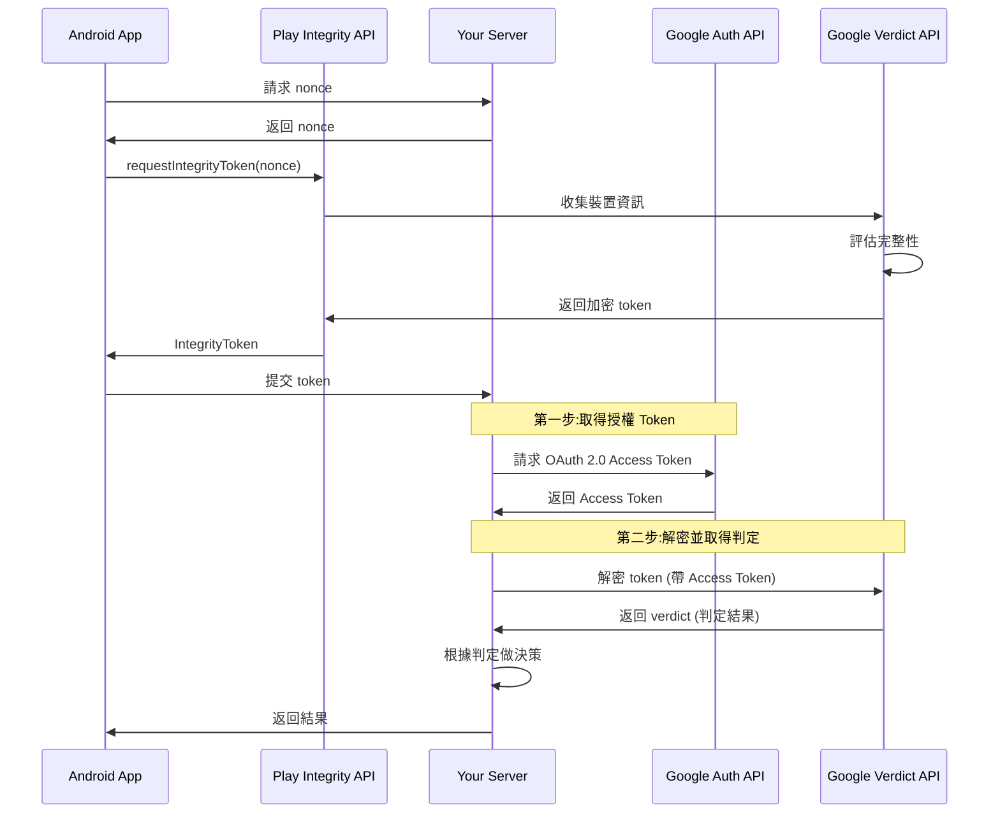

# 第 4 篇:Google Play Integrity 深入解析

## 前言:Android 平台的完整性驗證

在上一篇,我們了解了 reCAPTCHA 如何提供通用的人機識別。但是,reCAPTCHA 無法回答一個關鍵問題:**這個請求真的來自未被篡改的正版應用程式嗎?**

Google Play Integrity 專門解決這個問題,提供 **Android 平台專屬的應用程式與裝置完整性驗證**。

## Play Integrity 的核心價值

### 為什麼需要 Play Integrity?

```
reCAPTCHA 無法防範的攻擊:
├── 反編譯應用程式
├── 修改 APK 程式碼
├── 在模擬器上執行
├── 在 Root 裝置上繞過檢查
└── 使用破解工具修改應用行為

Play Integrity 可以偵測:
├── ✅ 應用程式是否來自 Play Store
├── ✅ 應用程式是否被篡改
├── ✅ 執行環境是否為真實 Android 裝置
├── ✅ 裝置是否通過 Google 認證
└── ✅ 裝置上是否有惡意軟體
```

### 與 reCAPTCHA 的差異

| 特徵 | reCAPTCHA | Play Integrity |
|------|-----------|----------------|
| 驗證對象 | 使用者行為 | 應用程式 + 裝置 |
| 防護重點 | 機器人、腳本 | 破解、模擬器 |
| 平台支援 | 跨平台 | 僅 Android |
| 驗證深度 | 行為分析 | 硬體 + 軟體完整性 |
| 依賴 | Google 服務 | Google Play Services |

## Play Integrity 核心概念

### 五大驗證維度

Play Integrity 從五個維度全面驗證請求的可信度:

#### 1. Request Details (請求詳情)

```
驗證內容:
├── Request Package Name
│   └── 確認請求來自正確的應用程式包名
├── Nonce
│   └── 防止重放攻擊的一次性隨機值
└── Timestamp
    └── 請求產生的時間戳記

目的:
├── 防止跨應用程式攻擊
├── 確保請求的新鮮度
└── 防止重放攻擊
```

**重要概念:**
- **Nonce (Number used once，一次性隨機數)**:伺服器產生的隨機值,確保每個 token 唯一
- 伺服器必須追蹤並核銷使用過的 nonce

#### 2. App Integrity (應用程式完整性)

```
應用程式完整性判定:
├── PLAY_RECOGNIZED
│   ├── 應用程式來自 Google Play
│   ├── 簽章與 Play Store 版本一致
│   └── 未被篡改或修改
│
├── UNRECOGNIZED_VERSION
│   ├── 應用程式包名正確
│   ├── 但版本不在 Play Store 中
│   └── 可能是測試版或舊版本
│
└── UNEVALUATED
    └── 無法評估(網路問題等)
```

**典型場景:**
- `PLAY_RECOGNIZED`:正常使用者從 Play Store 安裝
- `UNRECOGNIZED_VERSION`:開發者測試版、企業內部版
- 被拒絕:破解版、反編譯後重新打包的版本

#### 3. Device Integrity (裝置完整性)

這是 Play Integrity 最強大的部分,提供多層次的裝置完整性評估:

```
裝置完整性等級:
├── MEETS_DEVICE_INTEGRITY (最高等級)
│   ├── Google 認證的 Android 裝置
│   ├── 通過 Android 相容性測試
│   ├── 未被 Root
│   └── 系統完整性良好
│
├── MEETS_BASIC_INTEGRITY (基本等級)
│   ├── 可能不是 Google 認證裝置
│   ├── 或是 Google 認證但被修改
│   └── 基本的 Android 系統相容性
│
├── MEETS_STRONG_INTEGRITY (硬體支援等級)
│   ├── 具有硬體安全模組(HSM)
│   ├── 支援 Hardware-backed Keystore
│   └── 提供最高等級的安全保證
│
└── MEETS_VIRTUAL_INTEGRITY (虛擬環境)
    └── Google 官方模擬器(用於開發測試)
```

**重要概念:**

**MEETS_DEVICE_INTEGRITY:**
- 代表標準的 Android 生態系統
- 大部分正常使用者的裝置
- 最常見的完整性等級

**MEETS_BASIC_INTEGRITY:**
- 可能的情況:
  - 中國品牌手機(沒有 Google 認證)
  - Root 過的裝置
  - 自定義 ROM
  - 修改過的系統

**MEETS_STRONG_INTEGRITY:**
- 高階裝置才有
- 使用硬體安全晶片
- 提供 hardware-backed attestation

#### 4. Account Details (帳號詳情)

```
帳號授權狀態:
├── LICENSED
│   ├── 應用程式已透過 Play Store 取得
│   └── 對免費 App:表示已下載安裝
│   └── 對付費 App:表示已購買
│
├── UNLICENSED
│   └── 應用程式未透過 Play Store 合法取得
│
└── UNEVALUATED
    └── 無法評估授權狀態
```

**使用場景:**
- 防止盜版
- 驗證付費應用程式的授權
- 檢測側載(Sideloading)安裝

#### 5. Environment Details (環境詳情)

Environment Details 評估裝置的執行環境安全性,包含兩個主要欄位:

**可能的判定值:**

```
environmentDetails {
  playProtectVerdict: string    // Play Protect 狀態
  appAccessRiskVerdict: string  // 應用程式存取風險
}
```

**A. Play Protect Verdict (Play Protect 狀態)**

```
Play Protect 常見判定值（示意）:
├── PLAY_PROTECT_VERDICT_UNSPECIFIED
│   └── 未指定或無法判定
├── NO_ISSUES
│   └── Play Protect 已啟用且未發現問題
├── NO_DATA
│   └── 無法取得 Play Protect 資訊
├── MEDIUM_RISK
│   └── Play Protect 偵測到中度風險
└── HIGH_RISK
    └── Play Protect 偵測到高度風險

註：實際判定值以 Google 官方 SDK 回應為準，可能隨版本變動
```

**Play Protect 功能:**
- Google 內建的惡意軟體掃描服務
- 持續監控已安裝的應用程式
- 偵測潛在有害應用程式 (PHA)

**B. App Access Risk Verdict (應用程式存取風險)**

App Access Risk 會回傳 `appsDetected` 陣列,包含偵測到的應用程式類型。

**判定值分類:**

根據應用程式來源,判定值會有不同前綴:
- `KNOWN_*`: Google Play 或系統預載應用程式
- `UNKNOWN_*`: 其他來源安裝的應用程式

```
可能的判定值:
├── KNOWN_INSTALLED / UNKNOWN_INSTALLED
│   └── 偵測到已安裝的應用程式
├── KNOWN_CAPTURING / UNKNOWN_CAPTURING
│   └── 有執行中應用程式可查看螢幕畫面
├── KNOWN_CONTROLLING / UNKNOWN_CONTROLLING
│   └── 有執行中應用程式可控制裝置或攔截輸入/輸出
├── KNOWN_OVERLAYS / UNKNOWN_OVERLAYS
│   └── 有執行中應用程式可顯示疊加畫面
└── {} (空白)
    └── 未符合評估條件 (如裝置可信度不足)
```

**判定結果範例:**

| appsDetected | 意義 |
|-------------|------|
| `["KNOWN_INSTALLED"]` | 只有 Play 或系統應用,無風險 |
| `["KNOWN_INSTALLED", "UNKNOWN_CAPTURING"]` | 有其他應用正在擷取螢幕或輸入 |
| `["KNOWN_CONTROLLING", "UNKNOWN_INSTALLED"]` | 有 Play 應用正在控制裝置,且有其他來源應用 |
| `{}` | 無法評估 (裝置可信度不足等) |

**重要注意事項:**
- 經過 Google Play 無障礙功能審查的應用會被排除
- 工作資料夾中的應用一律標記為 `UNKNOWN_*`
- 空白結果可能原因:裝置可信度不足、Android 版本過舊、Play Store 版本過舊等

**使用建議:**
- 根據業務需求決定對不同風險等級的處理方式
- `CAPTURING` 和 `CONTROLLING` 應特別注意,可能影響敏感操作
- 可結合其他判定維度綜合評估

## Play Integrity 工作流程

### 基本流程



**關鍵步驟說明:**

1. **Nonce 生成:**
   - 伺服器產生隨機 nonce
   - 綁定到特定請求
   - 防止 token 被重複使用

2. **Token 請求:**
   - App 呼叫 Play Integrity API
   - 傳入 nonce
   - API 收集裝置和應用資訊

3. **Token 加密:**
   - Google 評估完整性
   - 生成加密的 token
   - Token 包含所有判定結果

4. **後端兩步驟 API 驗證:**

   **步驟 1 - 取得授權 Token:**
   - 使用 Service Account 憑證
   - 呼叫 Google OAuth 2.0 API
   - 取得短期有效的 Access Token
   - Endpoint: `https://oauth2.googleapis.com/token`

   **步驟 2 - 解密並取得判定:**
   - 使用步驟 1 的 Access Token
   - 呼叫 Play Integrity API
   - 傳入加密的 Integrity Token
   - Endpoint: `https://playintegrity.googleapis.com/v1/{package}/decodeIntegrityToken`
   - 獲得五大維度的判定結果

   **為什麼需要兩步驟?**
   - 安全性考量:Access Token 短期有效(通常 1 小時)
   - 權限隔離:Service Account 可精細控制權限
   - 防止濫用:每個 API 呼叫都需要有效授權

### Token 的特性

```
Integrity Token 特性:
├── 加密保護
│   └── 只有 Google 和您的伺服器能解密
├── 單次使用
│   └── Nonce 機制防止重放
├── 有時間限制
│   └── 通常幾分鐘內有效
└── 包含完整資訊
    └── 五大維度的判定結果
```

## 實作決策邏輯

### 如何解讀判定結果?

不同的業務場景需要不同的信任等級:

```
場景一:一般功能訪問
可接受的判定:
├── App Integrity: PLAY_RECOGNIZED
├── Device Integrity: MEETS_DEVICE_INTEGRITY 或 MEETS_BASIC_INTEGRITY
└── 決策: 允許

場景二:敏感操作(如支付)
嚴格要求:
├── App Integrity: 必須 PLAY_RECOGNIZED
├── Device Integrity: 必須 MEETS_DEVICE_INTEGRITY 或 MEETS_STRONG_INTEGRITY
├── Account Details: LICENSED
└── 決策: 拒絕任何不符合的情況

場景三:開發測試環境
寬鬆設定:
├── App Integrity: UNRECOGNIZED_VERSION (允許)
├── Device Integrity: MEETS_VIRTUAL_INTEGRITY (允許模擬器)
└── 決策: 用於開發階段
```

### 分層處理策略

```
根據完整性等級分層處理:

高信任等級:
├── PLAY_RECOGNIZED + MEETS_DEVICE_INTEGRITY
└── 動作: 完全訪問

中信任等級:
├── PLAY_RECOGNIZED + MEETS_BASIC_INTEGRITY
└── 動作: 允許但監控,限制敏感功能

低信任等級:
├── UNRECOGNIZED_VERSION
└── 動作: 限制功能,要求額外驗證

拒絕:
├── 無任何有效的 integrity 判定
└── 動作: 拒絕請求
```

## 常見挑戰與考量

### 1. Root 裝置處理

```
Root 裝置的判定:
├── 通常無法通過 MEETS_DEVICE_INTEGRITY
├── 可能通過 MEETS_BASIC_INTEGRITY
└── 完全無法通過 MEETS_STRONG_INTEGRITY

處理策略:
├── 嚴格應用: 拒絕所有 Root 裝置
├── 彈性應用: 允許但限制功能
└── 考量: 部分合法使用者可能使用 Root 裝置
```

**建議:**
- 金融、支付類應用:嚴格拒絕
- 一般應用:可以允許但監控
- 遊戲應用:視反作弊需求決定

### 2. 中國市場考量

```
中國市場挑戰:
├── 許多裝置沒有 Google Play Services
├── 無法使用 Play Integrity
└── 需要替代方案

替代策略:
├── 使用中國本地的完整性驗證方案
├── 或降級使用其他驗證機制
└── reCAPTCHA + 自定義檢測
```

### 3. 開發與測試環境

```
開發環境處理:
├── Debug 版本通常是 UNRECOGNIZED_VERSION
├── 模擬器返回 MEETS_VIRTUAL_INTEGRITY
└── 需要設定不同的驗證邏輯

建議做法:
├── 環境判斷
│   ├── Production: 嚴格驗證
│   ├── Staging: 中等驗證
│   └── Development: 寬鬆驗證
└── 使用 Build Variant 區分
```

## 與其他機制的配合

### 三層防護中的角色

```
第一層: reCAPTCHA
├── 防護: 機器人、腳本攻擊
└── 所有請求都要通過

第二層: Play Integrity (Android)
├── 防護: 破解應用、模擬器、惡意環境
├── 高風險操作必須通過
└── 提供裝置和應用完整性保證

第三層: 業務邏輯驗證
└── 應用程式特定的驗證規則
```

### 組合使用範例

```
使用者登入流程:
1. reCAPTCHA 檢查 (人機識別)
   ├── 分數 < 0.5: 拒絕
   └── 分數 >= 0.5: 繼續

2. Play Integrity 檢查 (完整性)
   ├── App != PLAY_RECOGNIZED: 拒絕
   ├── Device != MEETS_DEVICE_INTEGRITY: 額外驗證
   └── 通過: 允許登入

3. 業務邏輯檢查
   ├── 帳號狀態
   ├── 登入歷史
   └── 異常模式偵測
```

## 總結

### Play Integrity 的核心價值

**優勢:**  

✅ 強大的應用程式完整性驗證  
✅ 多層次的裝置完整性評估  
✅ 硬體級安全支援(STRONG_INTEGRITY)  
✅ 整合 Google Play 生態系  
✅ 偵測 Root、破解、模擬器  
✅ Play Protect 惡意軟體防護

**適用場景:**
- Android 應用程式防護
- 防止破解和逆向工程
- 遊戲反作弊
- 金融應用安全
- 付費內容保護

**局限性:**  

❌ 僅限 Android 平台  
❌ 需要 Google Play Services  
❌ 中國市場無法使用  
❌ Root 裝置可能被拒絕(影響部分合法使用者)  
❌ 需要較複雜的判定邏輯

### 關鍵概念回顧

1. **五大驗證維度**:全面評估請求可信度
2. **多層次完整性等級**:DEVICE/BASIC/STRONG/VIRTUAL
3. **Nonce 機制**:防止 token 重放攻擊
4. **分層處理**:根據不同信任等級採取不同策略
5. **環境感知**:開發、測試、生產環境不同處理

### 與 Apple App Attest 的對應

Play Integrity 和 Apple App Attest 解決相同的問題,但實作方式不同:

| 特徵 | Play Integrity | App Attest |
|------|----------------|------------|
| 平台 | Android | iOS |
| 核心 | Play Services | Secure Enclave |
| 完整性等級 | 多層次(4種) | 二元(通過/失敗) |
| 硬體支援 | STRONG_INTEGRITY | 強制硬體綁定 |
| 實作複雜度 | 中 | 高 |

---

在下一篇文章中,我們將深入探討 **Apple App Attest**,了解 iOS 平台如何利用硬體安全模組提供最高等級的完整性保證。

## 參考資源

- [Play Integrity API 官方文件](https://developer.android.com/google/play/integrity)
- [Integrity Verdict 解讀指南](https://developer.android.com/google/play/integrity/verdict)
- [Play Integrity 最佳實務](https://developer.android.com/google/play/integrity/overview#best-practices)
- [Classic API 遷移指南](https://developer.android.com/google/play/integrity/migrate)
