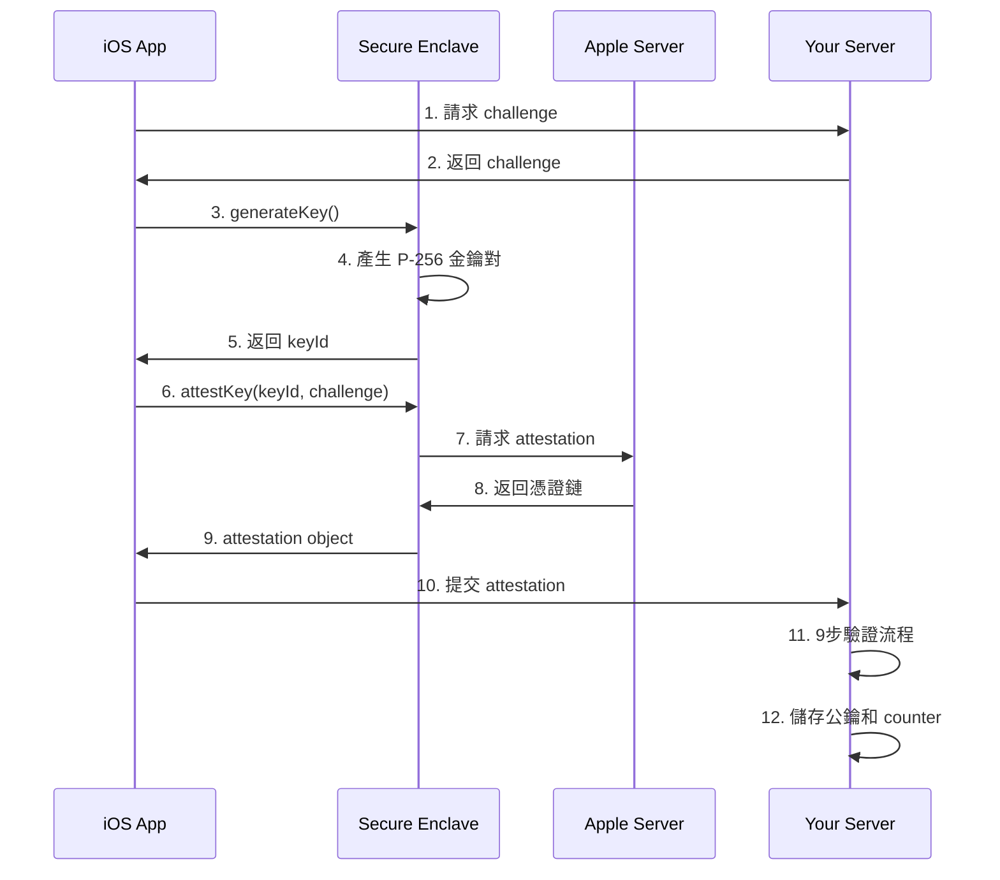
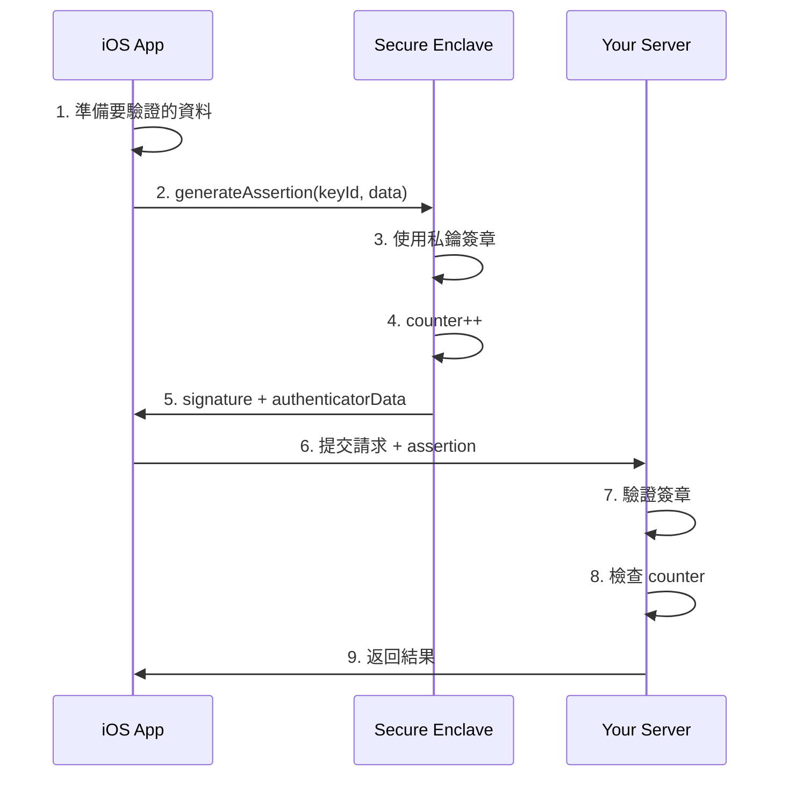

# 第 5 篇:Apple App Attest 深入解析

## 前言:iOS 生態的最高安全標準

在前兩篇中,我們了解了 reCAPTCHA 的人機識別和 Play Integrity 的 Android 完整性驗證。現在讓我們探討三大機制中**技術門檻最高、安全性最強**的方案:**Apple App Attest**。

## App Attest 的核心價值

### 為什麼 App Attest 最特別?

```
與其他機制的根本差異:
├── reCAPTCHA
│   ├── 分析: 使用者行為
│   ├── 基礎: 軟體分析
│   └── 結果: 風險分數

├── Play Integrity
│   ├── 分析: 應用 + 裝置
│   ├── 基礎: 軟體 + 部分硬體
│   └── 結果: 多層次判定

└── App Attest ⭐
    ├── 分析: 應用 + 裝置 + 硬體
    ├── 基礎: Secure Enclave (硬體信任根)
    └── 結果: 密碼學證明
```

**核心差異:**
- **硬體綁定**:私鑰永遠不離開 Secure Enclave
- **密碼學證明**:基於 WebAuthn 的公鑰密碼學
- **Apple PKI**:完整的憑證鏈驗證
- **不可偽造**:硬體級防護,極難攻破

### 三大機制安全強度對比

| 特性 | reCAPTCHA | Play Integrity | App Attest |
|------|-----------|----------------|------------|
| 安全基礎 | 行為分析 | 軟體完整性 | **硬體信任根** |
| 密鑰儲存 | 無 | 軟體 | **Secure Enclave** |
| 可被模擬 | 較容易 | 中等難度 | **極困難** |
| 防破解能力 | 低 | 中 | **極高** |
| 實作複雜度 | 低 | 中 | **極高** |
| 需要知識 | API 整合 | API 整合 | **密碼學專業** |

## App Attest 核心概念

### 1. Secure Enclave - 硬體信任根

```
Secure Enclave 特性:
├── 獨立處理器
│   └── 與主 CPU 完全隔離
├── 獨立記憶體
│   └── 加密儲存,無法從外部讀取
├── 獨立作業系統
│   └── Secure Enclave OS
├── 硬體隨機數產生器
│   └── True Random Number Generator
└── 私鑰永不離開
    └── 所有加密操作在內部完成
```

**為什麼這很重要?**
- 即使裝置被 Jailbreak,Secure Enclave 仍然安全
- 私鑰無法被匯出或複製
- 提供硬體級的信任基礎

### 2. 公鑰密碼學架構

App Attest 基於 WebAuthn 的設計理念:

```
公鑰密碼學流程:
├── 註冊階段 (Attestation)
│   ├── Secure Enclave 產生金鑰對
│   ├── 私鑰: 永遠留在 Secure Enclave
│   ├── 公鑰: 透過 Apple 憑證鏈傳送給伺服器
│   └── 伺服器: 驗證並儲存公鑰
│
└── 驗證階段 (Assertion)
    ├── App: 產生要驗證的資料
    ├── Secure Enclave: 使用私鑰簽章
    ├── 伺服器: 使用公鑰驗證簽章
    └── 結果: 確認請求來自未被篡改的 App
```

**關鍵概念:**
- **非對稱加密**:公鑰加密/驗證,私鑰解密/簽章
- **公鑰驗證**:伺服器無需取得私鑰,僅使用公鑰驗證簽章
- **不可偽造**:沒有私鑰就無法產生有效簽章

### 3. Apple PKI 憑證鏈

```
Apple 憑證信任鏈:
Apple Root CA (根憑證)
└── Apple App Attestation CA (中間憑證)
    └── Credential Certificate (裝置憑證)
        └── 包含: 公鑰 + App ID + Nonce

驗證流程:
1. 檢查憑證鏈完整性
2. 確認根憑證是 Apple Root CA
3. 驗證每層憑證簽章
4. 確認裝置憑證包含正確的 App ID
```

**這解決了什麼問題?**
- **來源驗證**:證明公鑰確實來自 Apple 裝置
- **App 綁定**:憑證包含 App ID,無法跨 App 使用
- **防偽造**:攻擊者無法偽造 Apple 的憑證鏈

## App Attest 工作流程

### 兩階段流程

App Attest 分為兩個階段:

#### 階段一:Attestation (證明/註冊)



**關鍵步驟說明:**

1. **Challenge 生成**:
   - 伺服器產生隨機 challenge
   - 綁定到這次 attestation
   - 防止重放攻擊

2. **密鑰產生**:
   - 在 Secure Enclave 內產生
   - 使用 P-256 橢圓曲線
   - 私鑰永不離開硬體

3. **Attestation 物件**:
   - CBOR 格式編碼
   - 包含憑證鏈
   - 包含公鑰資訊

4. **伺服器驗證**:
   - 9個步驟的嚴格驗證
   - 確保所有資訊正確
   - 儲存公鑰供後續使用

#### 階段二:Assertion (斷言/驗證)



**關鍵步驟說明:**

1. **資料準備**:
   - 計算要驗證資料的 hash
   - 可以是任何業務資料

2. **簽章產生**:
   - Secure Enclave 使用私鑰簽章
   - 同時遞增 counter
   - Counter 防止金鑰被複製

3. **伺服器驗證**:
   - 使用儲存的公鑰驗證簽章
   - 檢查 counter 遞增
   - 確認資料完整性

#### 階段三:Receipt 驗證 (裝置風險憑證)

除了 Attestation 和 Assertion,App Attest 生態系統還支援 **App Attest Receipt**,這是用於評估裝置環境與風險狀態的憑證。

```
App Attest Receipt 概念:
├── 目的:提供裝置環境與風險評估資訊
└── 內容:裝置風險評分與環境狀態資料
```

**Receipt 在 App Attest 中的角色:**

1. **獨立的風險評估憑證**:
   - 由 Apple 服務產生,包含裝置環境資訊
   - 用於輔助判斷裝置是否可信
   - 格式與欄位為 App Attest 專用,不同於 App Store 購買收據

2. **評估內容**:
   - 裝置風險指標
   - 環境完整性評估
   - 時間戳與有效期
   - 相關的 App Attest 使用記錄

**適用場景:**
- 需要持續評估裝置風險的應用
- 高安全要求的交易場景
- 偵測裝置環境變化

**注意事項:**
- App Attest Receipt 不等於 App Store 購買收據
- Receipt 驗證是可選的進階功能
- 格式與欄位需參考 Apple 官方文件

### Attestation Object 結構概念

```
Attestation Object (CBOR 格式):
├── fmt: "apple-appattest"
│   └── 表明這是 Apple App Attest 格式
│
├── attStmt (Attestation Statement)
│   └── x5c: [憑證鏈]
│       ├── x5c[0]: Credential Certificate
│       └── x5c[1]: Intermediate Certificate
│       └── receipt: App Receipt (風險評估使用)
│
└── authData (Authenticator Data)
    ├── rpIdHash: SHA256(Team ID + Bundle ID)
    ├── flags: 使用者驗證標記
    ├── counter: 初始為 0
    ├── aaguid: Apple App Attest AAGUID
    ├── credentialId: keyId
    └── credentialPublicKey: 公鑰 (CBOR 格式)
```

**每個欄位的作用:**

- **fmt**:識別格式類型
- **x5c**:憑證鏈,用於驗證公鑰來源
- **receipt**: App Receipt,用於評估裝置環境風險
- **rpIdHash**:綁定特定 App (Team ID + Bundle ID)
- **counter**:防止金鑰複製
- **aaguid**:識別是否為正式/開發環境
- **credentialPublicKey**:後續驗證用的公鑰

---

## ⚠️ 重要實作說明

在實作 App Attest 時，有兩個關鍵欄位的計算方式需要明確約定：**rpIdHash** 和 **clientDataHash**。

### rpIdHash 的計算方式

**Apple 官方規範:**
- rpIdHash = SHA256(App ID)
- App ID 格式：`<Team ID>.<Bundle ID>`

**本專案實作選擇:**
```
rpIdHash = SHA256(TEAM_ID + "." + BUNDLE_ID)

範例:
Team ID: "A1B2C3D4E5"
Bundle ID: "com.example.app"
App ID: "A1B2C3D4E5.com.example.app"
rpIdHash: SHA256("A1B2C3D4E5.com.example.app")
```

**為什麼要說明清楚:**
- 文章中曾寫「Team ID + Bundle ID」可能被誤解為直接串接
- 實際要加上「.」分隔符
- 這是 Apple 標準格式，必須遵守

### clientDataHash 的計算方式

**Apple 官方規範:**
- clientDataHash 是一個 32 bytes 的資料
- **沒有強制要求**一定要用 JSON hash
- 可以是任何 32 bytes 資料，只要前後端一致

**本專案實作選擇:**
```
clientDataHash = 伺服器產生的 32 bytes 隨機值 (challenge)

實作細節:
1. 伺服器產生 32 bytes 隨機 challenge
2. 將 challenge 原始值直接作為 clientDataHash
3. iOS 端呼叫 attestKey(keyId, challenge)
4. challenge 會被嵌入到 attestation object 中
```

**與 WebAuthn 的差異:**
- **WebAuthn**: clientDataHash = SHA256(JSON.stringify(clientData))
- **App Attest**: 可直接使用 32 bytes 隨機值

**為什麼選擇隨機值而非 JSON:**
1. ✅ **更簡單**: 不需要構造和解析 JSON
2. ✅ **更安全**: 32 bytes 隨機值已經足夠防重放
3. ✅ **符合規範**: Apple 文件並未要求 JSON 格式
4. ✅ **效能更好**: 減少序列化/反序列化開銷

**重要提醒:**
- 前端和後端**必須對 clientDataHash 的來源達成一致**
- 本專案約定：clientDataHash = 後端產生的 challenge 原始值
- 如果你的專案使用 JSON 方式，記得更新驗證邏輯

---

## 九步驗證流程

伺服器必須執行 **9 個步驟**來驗證 Attestation:

```
App Attest 九步驗證:
步驟 1: 驗證憑證鏈
├── 檢查 x5c 憑證鏈
├── 確認追溯到 Apple Root CA
└── 驗證每個憑證的簽章

步驟 2: 串接資料
├── authData + clientDataHash
└── 準備計算 nonce

步驟 3: 計算 nonce
└── SHA256(authData + clientDataHash)

步驟 4: 驗證憑證中的 nonce
├── 從憑證 OID 1.2.840.113635.100.8.2 提取
└── 與計算的 nonce 比對

步驟 5: 驗證公鑰 hash
├── 從憑證提取公鑰
├── 計算 SHA256(publicKey)
└── 與 keyId 比對

步驟 6: 驗證 RP ID Hash
├── 計算 SHA256(Team ID + Bundle ID)
└── 與 authData 中的 rpIdHash 比對

步驟 7: 驗證 Counter
└── Attestation 時必須為 0

步驟 8: 驗證 AAGUID
├── 正式環境: "appattest" (ASCII 10 bytes) + 6 個 0x00 = 16 bytes
└── 開發環境: "appattestdevelop" (ASCII 16 bytes)

步驟 9: 驗證 Credential ID
└── 與 keyId 比對
```

**為什麼需要這麼多步驟?**
- 每個步驟驗證一個安全屬性
- 全部通過才能確保完整性
- 任何一步失敗都代表可能被攻擊

## 關鍵技術概念

### 1. 為什麼需要這麼多密碼學知識?

App Attest 涉及多個密碼學領域:

```
必備密碼學知識:
├── ECC (橢圓曲線密碼學)
│   ├── P-256 曲線
│   ├── ECDSA 簽章
│   └── 公鑰格式轉換
│
├── X.509 憑證
│   ├── 憑證結構解析
│   ├── 憑證鏈驗證
│   └── OID 擴展欄位
│
├── CBOR 編碼
│   ├── 資料序列化
│   └── 巢狀結構解析
│
├── ASN.1 編碼
│   ├── DER 格式
│   └── 二進位解析
│
└── Hash 函式
    ├── SHA-256
    └── 資料完整性
```

**這就是為什麼前面的系列文章很重要:**
- 系列二:理解 ECC 和 ECDSA 原理
- 系列三:掌握 CBOR、ASN.1、X.509 格式
- 沒有這些基礎,無法正確實作 App Attest

### 2. Counter 機制

```
Counter 的作用:
├── 防止金鑰複製
│   └── 每次 assertion 都會遞增
├── 檢測異常
│   └── Counter 沒有遞增 = 可能被複製
└── 單調性
    └── Counter 只能增加,不能減少

實務檢查:
if (newCounter <= storedCounter) {
    // 可能的攻擊!
    // 金鑰可能被複製到另一個裝置
    alert_security_team();
}
```

### 3. App ID 概念

```
App ID 組成:
├── Team ID
│   └── Apple 開發者團隊識別碼 (10 characters)
├── Bundle ID
│   └── App 的唯一識別碼
└── 完整 App ID: "TEAM123456.com.example.myapp"

綁定機制:
├── rpIdHash = SHA256(App ID)
├── 憑證中包含 App ID 資訊
└── 無法跨 App 使用同一個金鑰
```

## 實務考量

### 1. Attestation vs Assertion 使用時機

```
Attestation (註冊):
├── 時機: App 首次啟動或重新安裝
├── 頻率: 一次性或極少
├── 目的: 建立信任,取得公鑰
└── 成本: 較高(涉及網路請求到 Apple)

Assertion (驗證):
├── 時機: 每次需要驗證的 API 請求
├── 頻率: 頻繁
├── 目的: 證明請求來自可信 App
└── 成本: 較低(本地簽章)
```

**建議策略:**
- Attestation:App 安裝後執行一次
- Assertion:綁定到關鍵 API 端點
- 不要每個請求都做 attestation(太昂貴)

### 2. 環境差異

```
正式環境 vs 開發環境:
├── AAGUID
│   ├── 正式: "appattest" (10 bytes) + 6 個 0x00 = 16 bytes
│   └── 開發: "appattestdevelop" (16 bytes)
│
├── 憑證鏈
│   ├── 都追溯到 Apple Root CA
│   └── 但中間憑證可能不同
│
└── 驗證邏輯
    └── 伺服器需要支援兩種環境
```

### 3. 失敗處理

```
常見失敗原因:
├── 網路問題
│   └── 無法連接到 Apple 服務器
├── iOS 版本
│   └── 需要 iOS 14.0+
├── 裝置支援
│   └── 需要支援 Secure Enclave
└── Jailbreak 裝置
    └── 可能無法產生有效 attestation

處理策略:
├── 提供 Fallback 機制
├── 降級到其他驗證方式
└── 記錄但不完全阻擋
```

## 與其他機制的關係

### 基於 WebAuthn 的設計

```
App Attest 借鑑 WebAuthn:
├── 相同概念
│   ├── Registration → Attestation
│   ├── Authentication → Assertion
│   ├── Authenticator → Secure Enclave
│   └── Public Key Cryptography
│
├── 相同資料結構
│   ├── CBOR 編碼
│   ├── AuthenticatorData 格式
│   └── Attestation Object 結構
│
└── 差異
    ├── WebAuthn: 網頁環境,使用者驗證
    └── App Attest: App 環境,裝置驗證
```

### 三層防護組合

```
完整的防護策略:
├── 第一層: reCAPTCHA
│   └── 所有請求的基礎防護
│
├── 第二層: App Attest (iOS)
│   ├── 高風險操作必須
│   └── 提供最高等級保證
│
└── 第三層: 業務邏輯
    └── App 特定的驗證規則
```

## 總結

### App Attest 的核心價值

**優勢:**  

✅ **硬體級安全**:Secure Enclave 提供最高保護  
✅ **密碼學證明**:基於公鑰密碼學,不可偽造  
✅ **Apple PKI**:完整的信任鏈  
✅ **防破解**:即使 Jailbreak 也難以攻破  
✅ **防複製**:Counter 機制偵測金鑰複製  
✅ **透明體驗**:背景執行,無需使用者互動

**適用場景:**
- iOS 應用最高等級安全需求
- 金融、支付應用
- 敏感資料存取
- 防止 API 濫用
- 付費內容保護

**局限性:**  

❌ **僅限 iOS**:只能用於 Apple 生態系  
❌ **實作複雜**:需要深厚的密碼學知識  
❌ **iOS 14.0+**:較舊系統無法使用  
❌ **需要 Secure Enclave**:部分老裝置不支援  
❌ **除錯困難**:錯誤訊息不明確

### 關鍵概念回顧

1. **Secure Enclave**:硬體信任根,私鑰永不離開
2. **公鑰密碼學**:非對稱加密,伺服器僅需公鑰驗證簽章
3. **兩階段流程**:Attestation 建立信任,Assertion 持續驗證
4. **九步驗證**:嚴格的伺服器端驗證流程
5. **Counter 機制**:防止金鑰被複製
6. **密碼學知識**:需要理解 ECC、X.509、CBOR、ASN.1

### 為什麼需要整個系列文章?

```
學習路徑回顧:
├── 系列一 (第1-5篇): 背景與全景
│   └── 理解為什麼需要 App Attest
│
├── 系列二: 密碼學基礎
│   ├── ECC 橢圓曲線
│   ├── ECDSA 簽章
│   └── 公鑰密碼學原理
│
├── 系列三: 資料格式
│   ├── CBOR 編碼
│   ├── X.509 憑證
│   ├── ASN.1 結構
│   └── Apple 特定格式
│
└── 系列四: 協定與應用
    ├── WebAuthn 設計
    └── App Attest 實作
```

只有完整理解所有層次,才能正確實作 App Attest!

---

至此,我們完成了三大驗證機制的詳細介紹。接下來的系列文章將深入密碼學基礎,為實作 App Attest 打下堅實的理論基礎。

## 參考資源

- [Apple App Attest 官方文件](https://developer.apple.com/documentation/devicecheck/validating_apps_that_connect_to_your_server)
- [App Attest 環境準備](https://developer.apple.com/documentation/devicecheck/preparing_to_use_the_app_attest_service)
- [WebAuthn 規範](https://www.w3.org/TR/webauthn-2/)
- [Apple Platform Security Guide](https://help.apple.com/pdf/security/en_US/apple-platform-security-guide.pdf)
