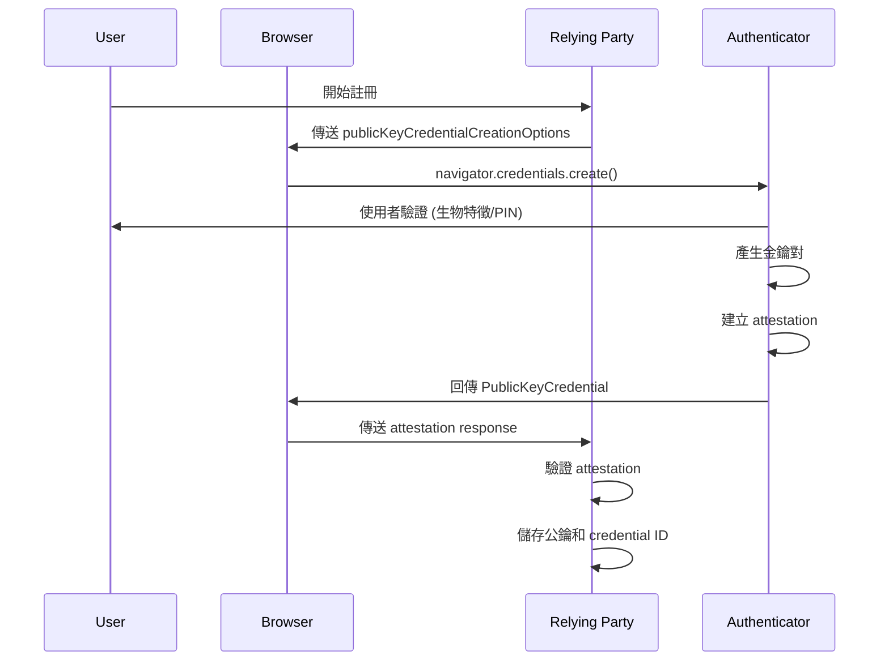
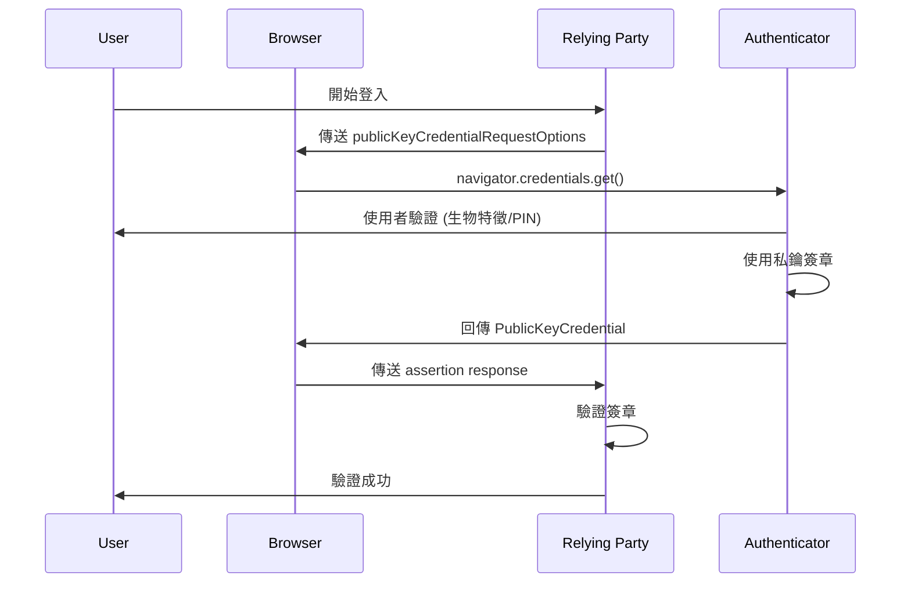

# 第 15 篇:WebAuthn 與裝置信任模型

## 前言:從密碼到裝置的信任轉換

經過前面文章的深入學習,我們已經掌握了密碼學的理論基礎和資料格式。現在我們要理解:**為什麼** Apple App Attest 要基於 WebAuthn 設計?這個協定如何重新定義了現代身分驗證的信任模型。

## 傳統身分驗證的困境

### 密碼驗證的根本問題

```
傳統驗證流程:
使用者 → [密碼] → 服務器
問題:
├── 密碼可被竊取
├── 密碼可被猜測
├── 密碼可被重放
├── 密碼可被釣魚
└── 密碼疲勞問題
```

### 多因子驗證的演進

```
驗證因子演進:
第一因子:知道什麼 (Something You Know)
└── 密碼、PIN、安全問題

第二因子:擁有什麼 (Something You Have)
└── 手機、硬體金鑰、App

第三因子:本體特徵 (Something You Are)
└── 指紋、面部、聲音
```

### 傳統 2FA 的限制

```
傳統雙因子驗證(TOTP/SMS)的問題:
├── 密碼仍然是弱點(第一因子可被竊取)
├── OTP 可被截取(簡訊/中間人攻擊)
├── SIM 卡交換攻擊(社交工程)
├── 釣魚攻擊仍然有效(使用者主動輸入)
└── 無法防止重放攻擊
```

## WebAuthn 設計理念

### 核心概念轉變

WebAuthn (Web Authentication) 代表了身分驗證範式的根本轉變:

```
從「共享秘密」到「公開金鑰」
├── 傳統:服務器儲存密碼雜湊
└── WebAuthn:服務器儲存公鑰

從「知識證明」到「所有權證明」
├── 傳統:證明你知道密碼
└── WebAuthn:證明你擁有私鑰

從「可複製」到「不可複製」
├── 傳統:密碼可以被複製
└── WebAuthn:私鑰無法離開裝置
```

### WebAuthn 核心組件

```
WebAuthn 生態系統:
├── Relying Party (RP) - 服務提供商
│   └── 網站或應用程式
├── Authenticator - 驗證器
│   ├── Platform Authenticator (內建)
│   │   ├── Windows Hello
│   │   ├── Touch ID/Face ID
│   │   └── Android Biometric
│   └── Roaming Authenticator (外部)
│       ├── USB 金鑰 (如 YubiKey)
│       ├── NFC 金鑰
│       └── Bluetooth 金鑰
└── User Agent - 瀏覽器/應用程式
    └── 協調 RP 與 Authenticator
```

## WebAuthn 協定架構

### 註冊流程 (Registration)



**關鍵步驟:**
1. 伺服器產生隨機 challenge
2. 驗證器在裝置上產生金鑰對(私鑰永不離開裝置)
3. 驗證器創建 attestation 證明
4. 伺服器驗證 attestation 並儲存公鑰

### 認證流程 (Authentication)



**關鍵步驟:**
1. 伺服器產生新的 challenge
2. 驗證器使用私鑰對 challenge 簽章
3. 伺服器使用儲存的公鑰驗證簽章

## 深入分析:ClientData 與 AuthenticatorData

### ClientData 結構

ClientData 包含了客戶端環境資訊:

```javascript
// ClientData 的 JSON 結構
const clientData = {
    type: "webauthn.create", // 或 "webauthn.get"
    challenge: "base64url-encoded-challenge",
    origin: "https://example.com",
    crossOrigin: false
};
```

**重要性:**
- `type`: 區分註冊或認證操作
- `challenge`: 防止重放攻擊
- `origin`: 防止釣魚攻擊(域名綁定)

### AuthenticatorData 結構

```python
class AuthenticatorData:
    def parse(raw_data):
        offset = 0

        # RP ID Hash (32 bytes)
        rp_id_hash = raw_data[offset:offset+32]
        offset += 32

        # Flags (1 byte)
        flags = raw_data[offset]
        user_present = bool(flags & 0x01)    # UP flag
        user_verified = bool(flags & 0x04)   # UV flag
        attested_data = bool(flags & 0x40)   # AT flag
        offset += 1

        # Sign Count (4 bytes)
        sign_count = int.from_bytes(raw_data[offset:offset+4], 'big')
        offset += 4

        # Attested Credential Data (如果 AT flag 設置)
        if attested_data:
            # AAGUID (16 bytes)
            aaguid = raw_data[offset:offset+16]
            offset += 16

            # Credential ID Length (2 bytes)
            cred_id_len = int.from_bytes(raw_data[offset:offset+2], 'big')
            offset += 2

            # Credential ID
            credential_id = raw_data[offset:offset+cred_id_len]
            offset += cred_id_len

            # Credential Public Key (CBOR)
            public_key = cbor2.loads(raw_data[offset:])
```

**重要性:**
- `rp_id_hash`: 確保請求來自正確的域名
- `flags`: 使用者驗證狀態
- `sign_count`: 防止憑證複製攻擊
- `AAGUID`: 識別驗證器類型

## 裝置信任與 Attestation

### Attestation 類型

WebAuthn 定義了三種 attestation 類型:

#### 1. None Attestation
- 不提供任何證明
- 適用於低風險場景
- 實作最簡單

#### 2. Self Attestation
- 驗證器使用自己產生的金鑰自我簽章
- 證明金鑰對是由驗證器產生的
- 無法驗證驗證器製造商

#### 3. Direct Attestation
- 使用製造商的憑證鏈簽章
- 可驗證驗證器的真實性
- **Apple App Attest 使用此類型**

### AAGUID 與裝置識別

```
已知的 AAGUID 範例:
├── Apple App Attest
│   ├── Production: "appattest" (10 bytes) + 6 個 0x00
│   ├── Development: "appattestdevelop" (16 bytes)
│   └── 註: AAGUID 需依 FIDO Metadata 或 Apple 官方文件確認
│
├── Windows Hello
│   ├── AAGUID: 08987058-cadc-4b81-b6e1-30de50dcbe96
│   └── 類型: Windows Hello Hardware
│
└── YubiKey 5 Series
    ├── AAGUID: fa2b99dc-9e39-4257-8f92-4a30d23c4118
    └── 類型: 硬體安全金鑰
```

**AAGUID 的作用:**
- 識別驗證器類型和製造商
- 協助伺服器評估信任等級
- FIDO Metadata Service 提供詳細資訊

## WebAuthn 與 Apple App Attest 的關係

### 協定層對應

```
WebAuthn Concepts    ←→    App Attest Equivalents
├── Registration     ←→    Attestation
├── Authentication   ←→    Assertion
├── Authenticator    ←→    Secure Enclave
├── AAGUID          ←→    Apple AAGUID
├── Attestation     ←→    X.509 Certificate Chain
├── ClientData      ←→    Client Data Hash
└── Challenge       ←→    Server Challenge
```

### 關鍵差異

| 特徵 | WebAuthn | App Attest |
|-----|---------|------------|
| 使用場景 | 網頁瀏覽器 | iOS原生App |
| 使用者互動 | 明確提示 | 透明背景驗證 |
| Attestation範圍 | 證明使用者 | 證明App和裝置 |
| Challenge來源 | 網頁提供 | 伺服器下發 |
| 硬體綁定 | 視驗證器而定 | 強制Secure Enclave |

## 安全威脅與防護

### 1. 釣魚攻擊防護

**WebAuthn 防護機制:**
- `origin` 綁定:簽章包含域名資訊
- 瀏覽器驗證:自動檢查域名
- 無法跨域使用:私鑰綁定特定域名

**示例:**
```
正常情況:
使用者訪問 https://bank.com
Authenticator 簽章 origin="https://bank.com"
伺服器驗證通過 ✅

釣魚攻擊:
使用者被誘導到 https://phishing-bank.com
Authenticator 簽章 origin="https://phishing-bank.com"
bank.com 伺服器驗證失敗 ❌
```

### 2. 中間人攻擊防護

- 簽章包含 `challenge`
- Challenge 單次使用
- HTTPS 強制要求

### 3. 裝置妥協檢測

- Sign Counter 機制
- Counter 必須單調遞增
- 異常則可能是憑證被複製

```python
def detect_cloned_authenticator(credential_id, new_count, stored_count):
    """檢測複製的驗證器"""
    if new_count <= stored_count:
        # 可能的複製攻擊
        logger.alert(f"Possible cloned authenticator: {credential_id}")
        return True
    return False
```

## 實務考量與限制

### 1. 瀏覽器支援度

現代瀏覽器普遍支援,但需要檢查:
- Chrome 67+
- Firefox 60+
- Safari 13+
- Edge 18+

### 2. 使用者體驗挑戰

- 使用者教育成本
- 裝置遺失時的復原機制
- 多裝置使用場景
- Fallback 機制設計

### 3. 設備遺失與帳號復原

**建議策略:**
- 註冊多個驗證器(主要+備用)
- 提供復原碼
- 管理員協助復原流程

## 總結

WebAuthn 代表了身分驗證技術的重大突破:

### 核心創新
1. **信任模型轉變**:從共享秘密到公開金鑰密碼學
2. **裝置綁定**:私鑰永遠不離開硬體安全模組
3. **防釣魚設計**:加密綁定到特定網域
4. **標準化協定**:跨平台、跨瀏覽器的統一標準

### 與 Apple App Attest 的關係

Apple App Attest 可以視為 WebAuthn 在 iOS 生態系統的特化實作:
- 使用相同的基礎概念(attestation、assertion)
- 採用相同的資料結構(CBOR、authenticatorData)
- 提供更強的硬體綁定(Secure Enclave)
- 整合 App Store 生態系統

理解 WebAuthn 的設計理念和技術架構,是掌握現代裝置驗證技術的關鍵基礎。

## 參考資源

- [W3C WebAuthn Specification](https://www.w3.org/TR/webauthn-2/)
- [FIDO Alliance Documentation](https://fidoalliance.org/specifications/)
- [WebAuthn Guide by Mozilla](https://developer.mozilla.org/en-US/docs/Web/API/Web_Authentication_API)
- [FIDO Metadata Service](https://fidoalliance.org/metadata/)
