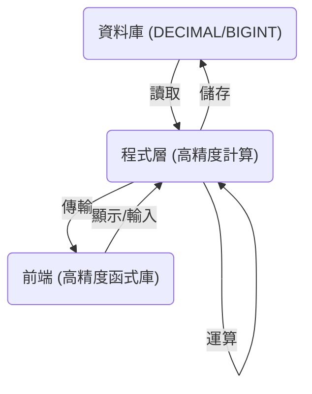

# 金額精度計算完整指南：從資料庫到前端

## 前言

在金融與商業應用中，金額計算的精確性是至關重要的。微小的浮點數誤差可能導致巨大的財務損失。本文將深入探討如何從資料庫儲存、後端程式處理、資料傳輸到前端顯示，全程確保金額計算的「分錢不差」。我們將參考業界最佳實踐，並以 PHP 和 Golang 為例，解析高精度計算的原理與實作。

## 1. 問題根源：IEEE-754 浮點誤差

電腦內部儲存數字的方式，特別是浮點數（`float` 和 `double`），是導致金額計算不精確的根本原因。大多數程式語言和硬體都遵循 IEEE-754 浮點數標準，該標準使用二進位來表示小數。然而，許多十進位小數（例如 0.1、0.2）在二進位中是無法被精確表示的，就像 1/3 在十進位中無法被精確表示為有限小數一樣。這會導致在儲存和運算過程中產生微小的誤差，這些誤差在經過多次累加、減法或複雜的匯率轉換後，可能會被放大，最終導致肉眼可見的差異，這對於財務系統來說是絕對不能接受的。

例如，在許多程式語言中執行 `0.1 + 0.2`，結果可能不是精確的 `0.3`，而是 `0.30000000000000004`。這種看似微不足道的差異，在處理大量交易或高頻次計算時，將會累積成嚴重的問題。

## 2. 資料庫層：只存「精準型別」

資料庫是金額資料的最終儲存地，因此選擇正確的資料型別是確保精確性的第一步，也是最關鍵的一步。絕對不能使用 `FLOAT` 或 `DOUBLE` 這類浮點數型別來儲存金額，因為它們在「存入那一刻」就可能因為浮點誤差而失真，導致資料庫中的金額與實際金額不符。

| 場景 | 推薦型別 | MySQL 範例 | Laravel Migration | 優點 | 缺點 |
| :--- | :--- | :--- | :--- | :--- | :--- |
| 一般金額 | `DECIMAL` (定點數) | `DECIMAL(15,2)` | `$table->decimal('amount', 15, 2)` | 精確儲存小數，直觀易懂 | 儲存空間較大，運算效能稍低 |
| 超精準匯率 | `DECIMAL` (擴充位數) | `DECIMAL(20,8)` | `$table->decimal('rate', 20, 8)` | 可自訂精度，滿足各種需求 | 同上 |
| 100% 無誤差 | `BIGINT` (最小單位整數) | `BIGINT` | `$table->unsignedBigInteger('amount_cents')` | 儲存空間小，運算效能高 | 需要手動轉換單位，可讀性較差 |

**反例**：

*   `FLOAT` / `DOUBLE`：會在「存進去那一刻」就失真，肉眼可見尾數，絕對禁止用於金額儲存。

    | 型別         | 位元寬度   | 標準名稱              | 近似有效位數       | 範例 (MySQL) |
    | ---------- | ------ | ----------------- | ------------ | ---------- |
    | **FLOAT**  | 32 bit | IEEE-754 binary32 | ≈ 7 位十進位     | `FLOAT`    |
    | **DOUBLE** | 64 bit | IEEE-754 binary64 | ≈ 15-16 位十進位 | `DOUBLE`   |

## 3. 程式層：高精度計算原理

從資料庫取出金額後，在程式中進行計算時，同樣需要全程避免使用語言內建的浮點數型別進行加減乘除運算。應使用專門的高精度數學庫或處理方式。這些高精度計算方式的底層原理，主要有兩種實現思路：

### 3.1. **任意精度數學 (Arbitrary-precision Arithmetic)**

這種方式也稱為「大數運算」(Bignum)，其核心思想是將數字當作字串來處理，並模擬人工計算的方式（例如直式加法、乘法）來進行運算。這種方式不受硬體浮點數單元的限制，可以處理任意長度的數字，且完全避免了二進位浮點數的精度問題。

*   **代表**：PHP 的 `bcmath` 擴展。
*   **原理**：`bcmath` 內部將數字以字串形式儲存。當進行運算時，它會逐位讀取字串中的數字，並根據運算規則（加、減、乘、除）進行計算，同時處理進位和借位。這種方式雖然效能上不如硬體浮點運算，但能保證結果的絕對精確。

### 3.2. **定點數數學 (Fixed-point Arithmetic)**

定點數是另一種表示和運算有理數的方式。它將數字表示為一個整數和一個固定的比例因子（scale）。例如，`123.45` 可以表示為整數 `12345` 和比例因子 `2`（即小數點後有兩位）。所有的運算都轉換為對整數的運算，從而避免了浮點數問題。

*   **代表**：Go 的 `shopspring/decimal`、Java 的 `BigDecimal`、Python 的 `Decimal`。
*   **原理**：這些庫內部通常維護一個 `unscaled value`（未縮放的整數值）和一個 `scale`（比例因子）。例如，`decimal.NewFromString("123.45")` 會在內部儲存 `value=12345` 和 `scale=2`。當兩個 `Decimal` 物件進行運算時，庫會先將它們的 `scale` 調整為一致（例如，通過乘以 10 的冪），然後對 `unscaled value` 進行整數運算，最後根據需要調整結果的 `scale`。這種方式在效能和精度之間取得了很好的平衡。

| 語言 | 推薦作法 | 底層原理 | 範例 |
| :--- | :--- | :--- | :--- |
| PHP | `bcmath` 擴展 | 任意精度數學 (字串運算) | `bcadd('123.45', '0.05', 2)` |
| PHP | `brick/money` | 定點數數學 (封裝 `brick/math`) | `Money::of('123.45', 'USD')->plus('0.05')` |
| Golang | `shopspring/decimal` | 定點數數學 (整數 + 比例因子) | `decimal.NewFromString("123.45").Add(decimal.NewFromString("0.05"))` |
| Java | `BigDecimal` | 定點數數學 (整數 + 比例因子) | `new BigDecimal("123.45").add(new BigDecimal("0.05"))` |
| Python | `decimal.Decimal` | 定點數數學 (整數 + 比例因子) | `Decimal("123.45") + Decimal("0.05")` |
| JavaScript | `decimal.js` / `big.js` | 定點數數學 (整數 + 比例因子) | `new Decimal('123.45').plus('0.05')` |

## 4. 傳輸層：JSON 必為「字串」或「整數分」

當後端處理完金額資料並需要傳輸給前端時，特別是透過 JSON 格式，必須格外小心。JavaScript 處理數字的機制與後端語言不同，它同樣存在浮點數精度問題。如果直接將浮點數傳輸給前端，JavaScript 會將其解析為浮點數，再次引入精度誤差。

| 方案 | 回傳 JSON | 前端讀取 | 優點 | 缺點 |
| :--- | :--- | :--- | :--- | :--- |
| 小數點字串 | `"amount": "127.21"` | `new Decimal('127.21')` | 直觀，易於除錯 | 前端需要額外處理字串轉數字 |
| 最小單位整數 | `"amount_cents": 12721` | `const yuan = val / 100` | 傳輸資料量小，前端處理簡單 | 可讀性差，需要前後端約定單位 |

**❌ 千萬不要**：直接回傳浮點數，例如 `{ "amount": 127.21 }`。這會導致瀏覽器在解析時將其變為 `127.20999999...`，再次引入精度問題。

## 5. 完整流程圖

為了確保金額從頭到尾的精確性，整個流程應遵循以下閉環路徑：

1.  **讀取**：從資料庫 (`DECIMAL` 或 `BIGINT`) 讀取金額資料到程式中。
2.  **計算**：在程式層，將讀取到的資料轉換為高精度物件（例如 `Decimal` 或 `Money` 物件），並使用這些物件進行所有金額相關的運算。
3.  **儲存**：運算完成後，將高精度物件轉換回 `DECIMAL` 相容的字串或 `BIGINT` 整數，再儲存回資料庫。
4.  **傳輸**：若要將資料傳給前端，將高精度物件轉換為「字串」或「最小單位整數」後，透過 JSON 傳輸。
5.  **顯示/輸入**：前端接收到資料後，使用 `decimal.js` 等高精度函式庫進行解析、運算和顯示。使用者輸入的金額也應以字串形式傳回後端。

這個閉環確保了金額在儲存、計算、傳輸和顯示的每一個環節，都處於精確的表示形式下，從而杜絕了浮點誤差的產生。

## 6. 結論速記

遵循以下四個關鍵步驟，可以確保金額從資料庫到使用者畫面，永遠精確無誤：

*   **存**：資料庫使用 `DECIMAL` 或 `BIGINT` (最小單位整數) 型別儲存金額。
*   **算**：程式層使用高精度數學庫，全程以高精度物件進行運算。
*   **傳**：JSON 傳輸時，金額只給 `string` 或 `int` (最小單位整數)。
*   **顯**：前端接收到資料後，再用高精度庫解析和顯示。

照此四步，從資料庫到使用者畫面，金額永遠精確。

## 參考資料

*   [Decimal.js：JavaScript 中的高精度十進制運算庫 - Calpa 的煉金工房](https://calpa.me/blog/decimaljs-high-precision-decimal-calculations/)
*   [PHP浮點數精度問題 - 方格子](https://vocus.cc/article/64e6087dfd8978000128d8d4)
*   [golang 金额高精度计算 - 稀土掘金](https://juejin.cn/post/7126800145525506085)

---

_此篇文章由AI輔助撰寫_  

